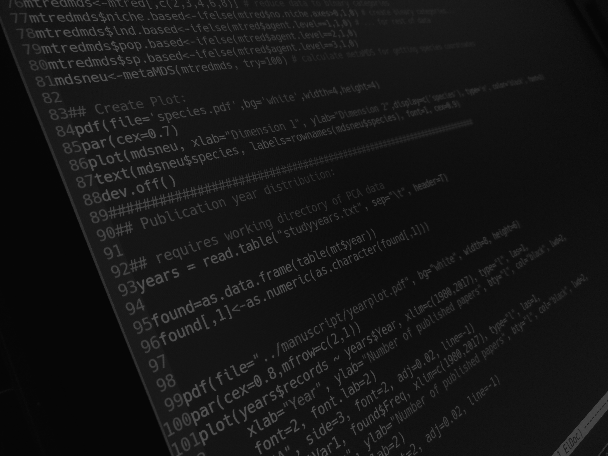

## anaLife Data Science

<!------>

We are a StartUp from Würzburg and offer a wide range of Data Science related services.

- Analysis of all kinds of data
- Data driven consulting
- Bioinformatics
- Courses in data analysis, Unix and programming

If you have any questions and want to contact us, please click the button below.

<a href="mailto:info@analife.de" id="contact" class="contact_button"> Contact Us </a>

<!---

### Analysis service

You have a dataset and want to learn something from it?
We are here to help! [Contact us](mailto:info@analife.de)
for an individual offer.

### Data Driven Consulting

We can help you optimizing your buisness.

- Reduce storage and logistics cost by predicting your future sales.
- Improve your sales by analysing who buys what
- Streamline processes by predicting dead ends

[Contact us](mailto:info@analife.de) for your potential.

### Bioinformatics

We offer various bioinformatic services. Some examples are

- Analysis of genome and transcriptome sequencing data
- Metagenomics
- Differential gene expression analysis
- Quantitative genetics
- Ecosystem modeling

[Contact us](mailto:info@analife.de) with your research questions.

### Courses

Want to learn more about data analysis, Linux/Unix or programming?
We offer courses of various length and levels.
[Contact us](mailto:info@analife.de) if you are interested in learning more.
-->